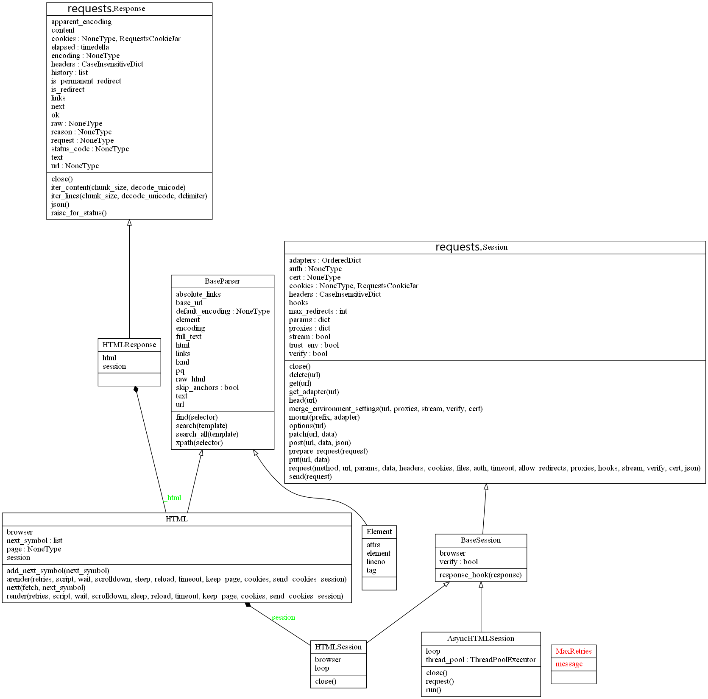

# requests_html库

requests_html是一个基于requests库的http请求，并解析HTML的库，源码位于 [requests-html——github](https://github.com/psf/requests-html/blob/master/requests_html.py)

目录
- [requests_html库](#requests_html库)
  - [源码结构](#源码结构)
  - [UML类图](#uml类图)
  - [请求会话部分](#请求会话部分)
    - [同步会话](#同步会话)
    - [异步会话](#异步会话)
## 源码结构

`requests_html.py`可以分为下面两部分：

- HMTL解析：
  - 包含父类BaseParser、和子类HTML、Element
- 请求和会话：
  -  包含父类BaseSession、和子类HTMLSession、AsyncHTMLSession

```bash
BaseParser
    ├──HTML # 将html文档传入HTML类中进行封装
    ├──Element # HMTL的元素

HTMLResponse(requests.Response) # 使用hook回调函数，封装requests.Response类

BaseSession(requests.Session) # 定义并绑定封装http响应的钩子函数
    ├──HTMLSession # 同步会话：增加了调用browser
    ├──AsyncHTMLSession # 异步会话：支持异步和并发的会话
```

## UML类图



## 请求会话部分

### 同步会话

文档中给的的hello world例子如下：

```python
 >>> from requests_html import HTMLSession
 >>> session = HTMLSession() # 实例化一个HTMLSession会话
 >>> r = session.get('https://python.org/') # 发起GET请求
 >>> print(r) 
<Response [200]> # 返回一个Response类的实例
```

HTMLSession是程序的入口，可以通过HTMLSession的实例发起请求。关于会话的类的继承关系如下：

```python
requests.Session # requests包中的Session类
├──BaseSession # 定义并绑定封装http响应的钩子函数
        ├──HTMLSession # 同步会话：增加了调用browser
        ├──AsyncHTMLSession # 异步会话：支持异步和并发的会话
```

从类图上可以看到，HTMLSession类无get方法，实际调用的是requests.Session类的get方法。

请求的动作是由requests库发起的，而requests_html中的HTMLSession类主要用来封装返回的http响应Response实例

**HTMLSession类如何封装Response类？**

使用了requests库的[事件钩子event-hooks](https://requests.readthedocs.io/zh_CN/latest/user/advanced.html#event-hooks)，具体实现步骤为

1. 初始化时向hooks属性新增一个"response"键，并绑定回调函数response_hook，当返回响应事件发生时，会调用hook回调函数

2. 在回调函数response_hook中将封装动作委托给HTMLResponse类

3. 用requests.Response实例 的`__dict__`字段，更新HTMLResponse实例的`__dict__`。

   具体代码见HTMLResponse类的_from_response函数，

   > Q：r = session.get('https://python.org/')，为什么print(r)输出的是<Response [200]>？
   >
   > A：Response 类中的`__repr__`属性，也被一同更新到HTMLResponse实例上了，所以print(r)调用的是Response类中的`__repr_`方法

BaseSession类和HTMLSession类的源码如下：


```python
class BaseSession(requests.Session):
    """ A consumable session, for cookie persistence and connection pooling,
    amongst other things.
    """

    def __init__(self, mock_browser: bool = True, verify: bool = True,
                 browser_args: list = ['--no-sandbox']):
        super().__init__()

        # Mock a web browser's user agent.
        if mock_browser:
            self.headers['User-Agent'] = user_agent()

        # 将回调函数绑定到hooks['response']属性
        self.hooks['response'].append(self.response_hook)
        self.verify = verify

        self.__browser_args = browser_args

    def response_hook(self, response, **kwargs) -> HTMLResponse:
        """ 
        钩子回调函数：`response_hook(response, **kwargs)` 接受一个位置参数response，和多个关键字参数
        Change response encoding and replace it by a HTMLResponse.
        """
        if not response.encoding:
            response.encoding = DEFAULT_ENCODING
            
        # 将封装response的工作，委托给HTMLResponse类
        return HTMLResponse._from_response(response, self)
    
    
class HTMLSession(BaseSession):

    def __init__(self, **kwargs):
        super(HTMLSession, self).__init__(**kwargs)

    @property
    def browser(self):
        if not hasattr(self, "_browser"):
            self.loop = asyncio.get_event_loop()
            if self.loop.is_running():
                raise RuntimeError(
                    "Cannot use HTMLSession within an existing event loop. Use AsyncHTMLSession instead.")
            self._browser = self.loop.run_until_complete(super().browser)
        return self._browser

    def close(self):
        """ If a browser was created close it first. """
        if hasattr(self, "_browser"):
            self.loop.run_until_complete(self._browser.close())
        super().close()
```

HTMLResponse类的源码如下：


```python
class HTMLResponse(requests.Response):
    """
    An HTML-enabled :class:`requests.Response <requests.Response>` object.
    Effectively the same, but with an intelligent ``.html`` property added.
    """

    def __init__(self, session: Union['HTMLSession', 'AsyncHTMLSession']) -> None:
        super(HTMLResponse, self).__init__()
        self._html = None  # type: HTML
        self.session = session

    @property
    def html(self) -> HTML:
        if not self._html:
            self._html = HTML(session=self.session, url=self.url,
                              html=self.content, default_encoding=self.encoding)
        return self._html

    @classmethod 
    def _from_response(cls, response, session: Union['HTMLSession', 'AsyncHTMLSession']):
        html_r = cls(session=session)
        html_r.__dict__.update(response.__dict__)
        return html_r
```

### 异步会话

```python
class AsyncHTMLSession(BaseSession):
    """ An async consumable session. """

    def __init__(self, loop=None, workers=None,
                 mock_browser: bool = True, *args, **kwargs):
        """ Set or create an event loop and a thread pool.

            :param loop: Asyncio loop to use.
            :param workers: Amount of threads to use for executing async calls.
                If not pass it will default to the number of processors on the
                machine, multiplied by 5. """
        super().__init__(*args, **kwargs)

        self.loop = loop or asyncio.get_event_loop()
        self.thread_pool = ThreadPoolExecutor(max_workers=workers)

    def request(self, *args, **kwargs):
        """ Partial original request func and run it in a thread. """
        func = partial(super().request, *args, **kwargs)
        return self.loop.run_in_executor(self.thread_pool, func)

    async def close(self):
        """ If a browser was created close it first. """
        if hasattr(self, "_browser"):
            await self._browser.close()
        super().close()

    def run(self, *coros):
        """ Pass in all the coroutines you want to run, it will wrap each one
            in a task, run it and wait for the result. Return a list with all
            results, this is returned in the same order coros are passed in. """
        tasks = [
            asyncio.ensure_future(coro()) for coro in coros
        ]
        done, _ = self.loop.run_until_complete(asyncio.wait(tasks))
        return [t.result() for t in done]
```

